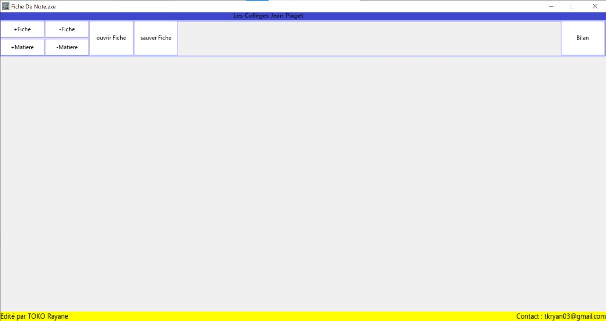

# markMaster

markMaster is a program designed to automate the calculation of averages, simplifying grade management. This project was developed to address a personal challenge and make the grading process more efficient.

**Disclaimer:** *This program can work correctly only on a specifique environment*

- Windows 10

- Resolution 1366 x 768
  
  It could work on another environment but graphical bug can appear. 


## Table of Contents

- [overview](#overview)
- [dependencies](#dependencies)
- [Installation](#installation)
- [Usage](#usage)
- [Note](#note)

## Overview

The markMaster program allows users to enter grades and automatically calculate averages, reducing the risk of human error.

### 💡 **Key learnings:**

- Building a full project from scratch

- Compiling and linking with dependencies manually

- Using a low-level graphics library (SDL2)

- Handling user input and interface rendering

## Dependencies

- SDL2

- SDL_ttf

## Installation

1. Clone the repository:
   
   ```bash
   git clone https://github.com/votre-utilisateur/markMaster.git
   ```

2. Navigate to the project directory:
   
   ```bash
   cd markMaster/app
   ```

3. Compile/execute the program:
   An executable is available for window juste execute it 😀. If you want to recompile:
   
   ```bash
   mkdir obj
   gcc -Wall -Iinclude $(sdl2-config --cflags) -c src/*.c -o obj/temp.o && gcc -g -o mark_master obj/*.o $(sdl2-config --libs) -lSDL2_image -lSDL2_ttf -lSDL2_mixer -lm
   ```
   
   **Or**
   
   ```bash
   make
   ```

## Usage

To run the program, use the following command:

```bash
./mark_master
```




## Note

This project represents my learning journey in programming. I decided to create this tool to automate a task that I found tedious, and this experience allowed me to develop my programming skills and learn how to solve problems creatively. At the time, the calculation of class averages was manual, which could waste a little time. Why don't I use excel 😮? First of all because I didn't 😅 know it, and in addition, for me it was a challenge and it was more fun 😀.

⚠️ The code reflects my skill level at the time – with inconsistent naming, long functions, and an overall "spaghetti" structure. While not clean or production-ready, this project played a big role in my learning path and growth as a developer.
